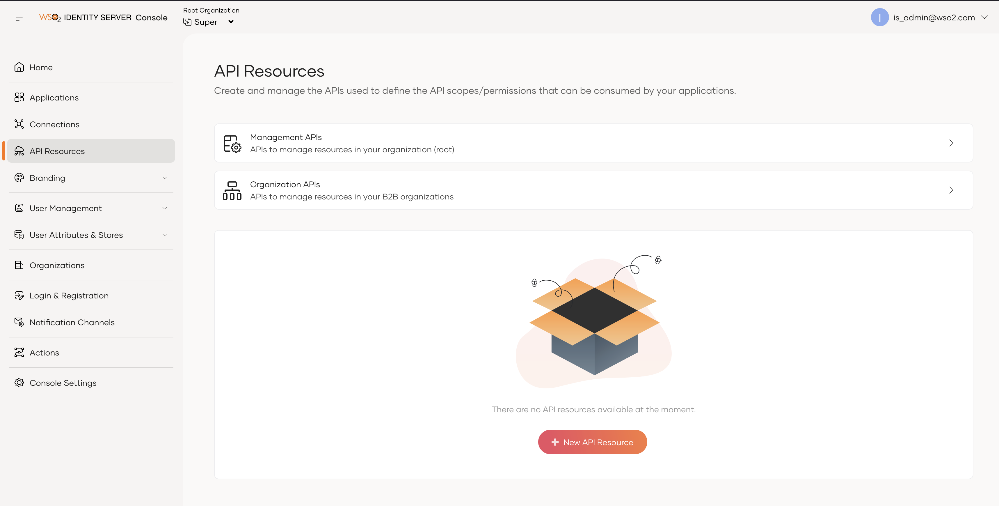
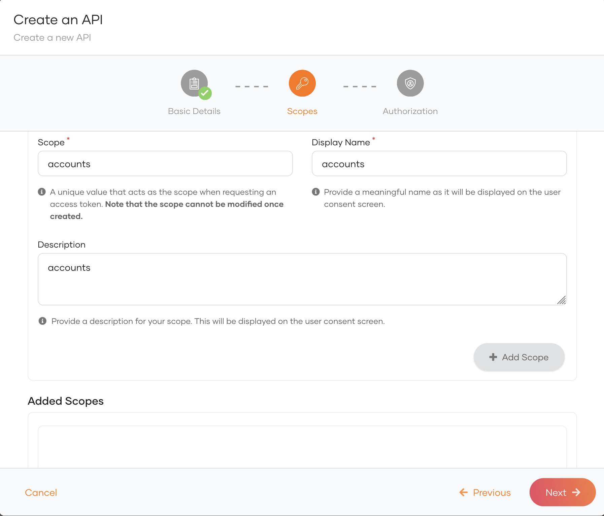
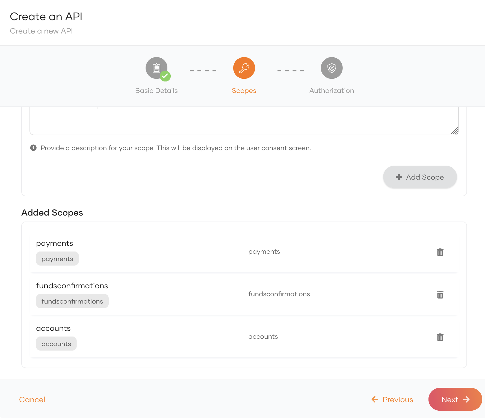
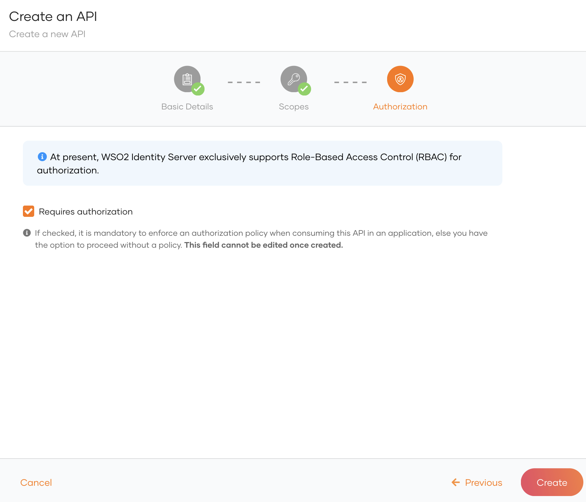
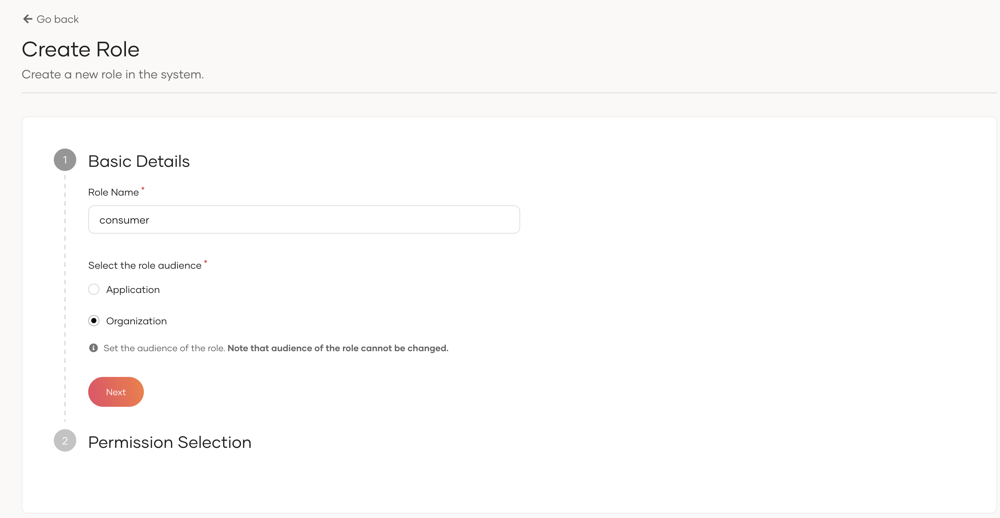
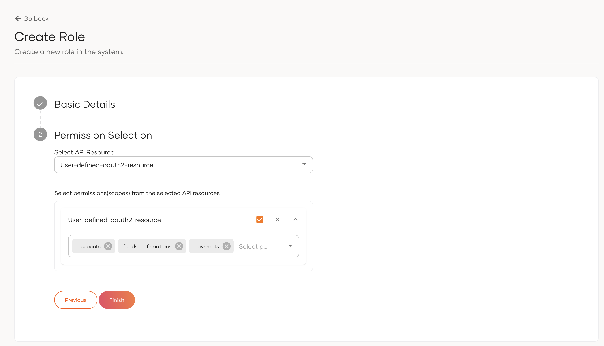
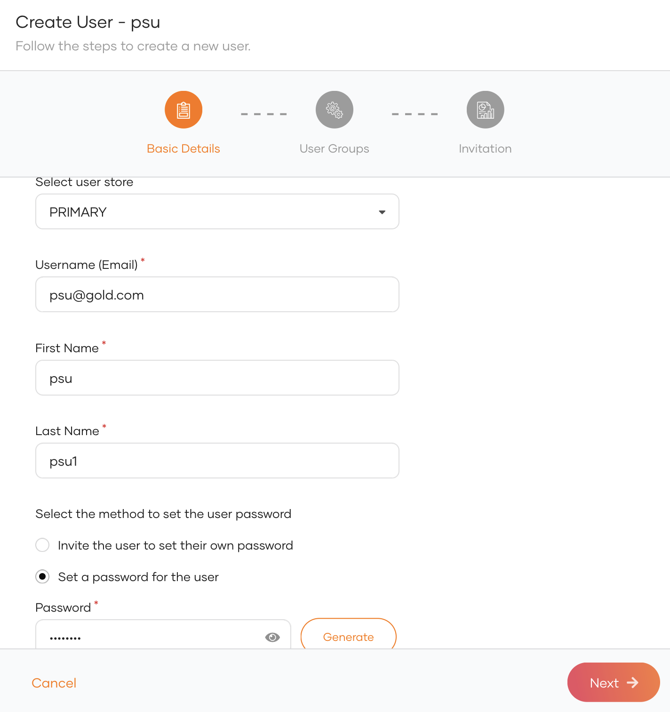
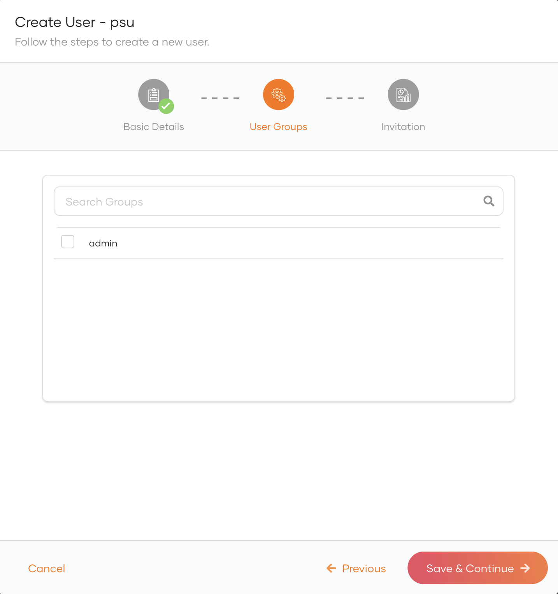
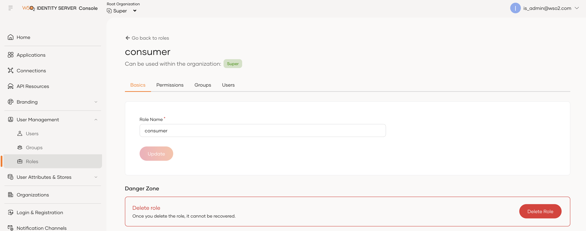
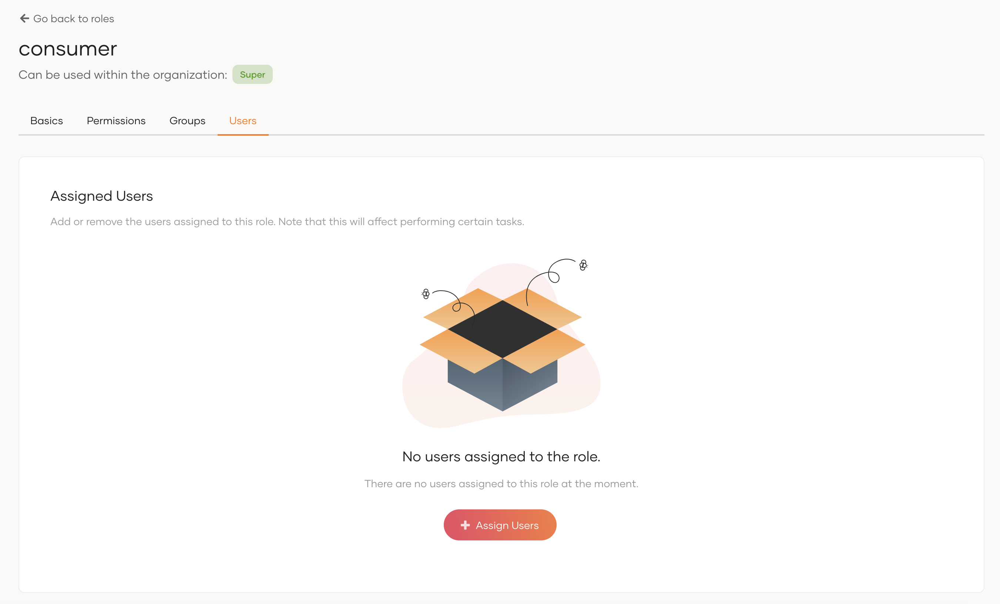

Now you have started the servers, let’s create the API resources, users and define their permissions and roles.
 
## Sign in to the Identity Server
 
1. Sign in to the Management Console of WSO2 Identity Server at [https://localhost:9446/console](https://localhost:9446/console)

2. Use the default super admin credentials as follows:
    - Username: is_admin@wso2.com
    - Password: wso2123
    
    !!!note
        The above login credentials are for testing purposes only. It is recommended to change the login credentials in 
        a production environment.

## Create API resources

1. Go to the **Api Resources** tab in the left pane.
2. Click **New API Resource**.

   
    
3. Enter **Identifier** and **Display Names**.

   | Text Field    | Value                        | 
   |---------------|------------------------------|
   | Identifier    | User-defined-oauth2-resource |
   | Display Names | User-defined-oauth2-resource |

    

4. Click **Next >**.
5. Add the following scopes one at a time: **accounts**, **payments**, and **fundsconfirmations**. 
   For each scope, enter the Scope and Display Name as shown below.
    

6. Once all scopes have been added, they will be displayed as shown below.
    

7. Click **Next >**.
8. Click **Create**.
    

## Create new user roles

1. Go to the **User Management** tab in the left pane and select **Roles**. 
   
2. Click **+ New Role**.
3. Create the following user role:   
  
    | Role Name | Role audience  | Permissions                  | Description                                                               |
    |-----------|----------------|------------------------------|---------------------------------------------------------------------------|
    | consumer  | Organization   | User-defined-oauth2-resource | Users must have the Consumer role to proceed with the authorization flow. |
    
    i. Creating **consumer Role**:
    
      - Enter the role name as **consumer** and select the role audience as **Organization**:
      
        
      
      - Click **Next >**.
      
      - Select the API Resource 'User-defined-oauth2-resource' created in [Create API resources](#create-api-resources).
      - Select all three permissions of the 'User-defined-oauth2-resource' resource.
      
        
            
      - Click **Finish**.
 
## Create new users

1. Go to the **User Management** tab in the left pane and select **Users**.
   

2. Click **Add User** --> **Single User**.
3. Enter the basic details of the user and set a password. Select PRIMARY user store.

    

4. Click **Next >**.

    !!!note Select the admin group, If you want to add the user to the admin group. Otherwise, continue without selecting the Admin group.

5. Click **Save and Continue**.
    

6. Click **Close**.

## Assign roles to the user
1. Go to the **User Management** tab in the left pane and select **Roles**.
   

2. Click on the **consumer** role created in [Create new user roles](#create-new-user-roles)
    

3. Go to **Users** tab.
4. Click **Assign Users**.
    

5. Click **Assign User** drop-down --> select user from the drop-down.
    

6. Click **Update**.
