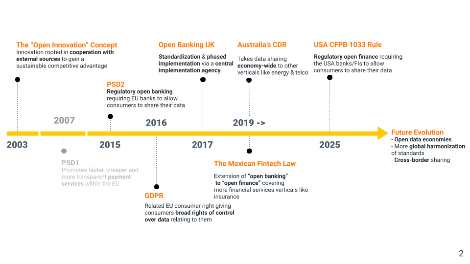

## What is Open Banking and Open Finance?

**Open banking** is a concept that enables banks, customers, and third parties to use and benefit more from the vast silos 
of data held by banks on their customers. Fundamentally, open banking allows bank customers to share their financial 
data with third parties with their consent. In technical terms, this is done via secure APIs that allow the customers 
or authorised API consumer applications to access data held by the bank. It is envisioned that upon wide adoption, an 
ecosystem of APIs would be created with various third-party applications, services and intermediary platforms 
integrating with banks to reinvent financial services using customer data. 

This gives customers more control over their data and greater financial transparency. It enables non-banking financial 
service providers and newer entrants such as fintech to participate more actively and meaningfully in generating 
customized user experiences for consumers. Open Banking reshapes the banking industry by encouraging networking of data 
and innovation across various financial institutions.

**Open Finance** extends the principles of Open Banking beyond just banks and current accounts. It aims to provide consumers 
with access to a wider range of financial data, including:

- Loans and mortgages 
- Investment accounts 
- Insurance policies 
- Pensions and retirement funds 
- Utility payments and billing data

Open Finance creates a more comprehensive financial data-sharing ecosystem, giving consumers a unified view of their 
financial lives and enabling more intelligent, data-driven financial services.
Together, Open Banking and Open Finance are reshaping the financial services landscape by:

 - Encouraging interoperability among financial institutions 
 - Promoting competition and innovation 
 - Enabling hyper-personalized products and services 
 - Supporting greater financial inclusion

This shift toward openness represents a significant step in putting consumers at the center of financial 
ecosystems—granting them ownership and control over their own data while driving the next generation of 
financial technology.

The **Open Innovation Concept** defined by Henry Chesbrough at Berkley promotes innovation rooted in cooperation with 
external sources to gain a sustainable competitive advantage. This concept contradicts secrecy and siloed methods. 
Open banking stems from this concept.  

Then introduced a legal framework known as **PSD1** to promote faster, cheaper and 
more transparent payment services within the European Union (EU) impacting how incumbents operate and promoting the 
entry of new players. **PSD2**, which is the revised version of PSD1 introduced the concept of open banking by regulatory 
means requiring banks across the EU to allow consumers to share their data with authorized third parties. **GDPR** 
introduced a composition to data privacy laws across the EU. GDPR and PSD2 interrelate in terms of consent for data 
sharing and preserving rights of control for consumers over their data. The world has embraced and extended the open 
banking concept according to their requirements. 

Countries and regions have established their own standards and implemented them in phased approaches. Certain countries
are experimenting with an extension of open banking, known as open finance that enforces data sharing across financial
service verticals like **The USA CFPB 1033 rule** . In addition to this, there are economy-wide data sharing propositions
like the **Australian CDR**. Economy-wide efforts are now playing out in the UK - Smart Data and the EU as well. For more
information on current regulations and standards, see [open banking regulations and standards](regulations-and-standards.md).

## A sample open banking use case

Open Banking has several use cases and advantages. Here’s one example of how open banking works in practice. 
If you are a customer who is looking for housing loans, open banking can enable a loan comparison service to access 
your financial data so that the service can suggest you the most suitable options based on your financial history.  

Open banking enables customers to view all bank accounts in one place making it easier to manage and budget. 
They also have the benefit of making all their payments using a single third-party provider application on behalf 
of them.

## Stakeholders in Open Banking / Open Finance
   
The open banking ecosystem comprises 4 main stakeholders.
   
   * **Customer** - The owner of a bank account who can grant access to the API consumer applications to retrieve 
   account information or initiate payments on their behalf. With open banking in the picture, the owner can use a 
   single application to manage the accounts and initiate a payment on behalf of them. The customers have more control 
   over their data as they can manage and revoke the API consumer applications’ access to the financial information.
   
   * **API consumer application** - An authorized third-party financial service provider that uses standard APIs to 
   access customer’s accounts. API consumer applications play several roles such as retrieving account information, 
   initiating payments on behalf of the customers, and checking available funds.  
   
   * **Financial institution** - An entity such as a bank that provides and maintains a payment account for a customer. 
   With customer consent, they share account and transaction data via API endpoints and let API consumer applications 
   make payments on behalf of the customer. 
   
   * **Merchant** - A vendor who accepts online payments in exchange for their products or services. A merchant can 
   use a single API consumer application to accept payments easily from multiple banks. Unless the customer wants to 
   make a payment from their bank account, the role of a merchant is not available in all open banking use cases.
   
 There are other stakeholders such as the government, technology providers, and consultancy service providers that 
 are involved in open banking.

## Customer Stories and Use Cases
WSO2 Open Banking Accelerator delivers comprehensive technology and strategic consultancy to help you execute 
standards-compliant, commercially successful open banking initiatives. For more information, see our [customer stories 
and use cases](https://wso2.com/solutions/financial/open-banking/#customer-stories-and-use-cases).