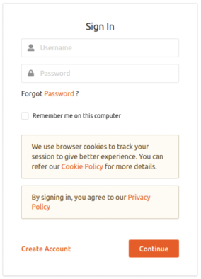
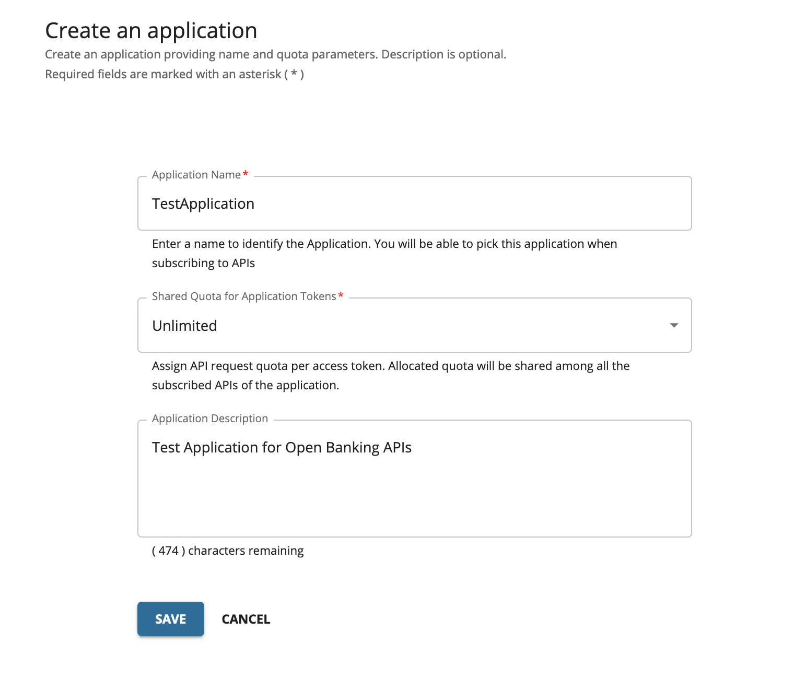
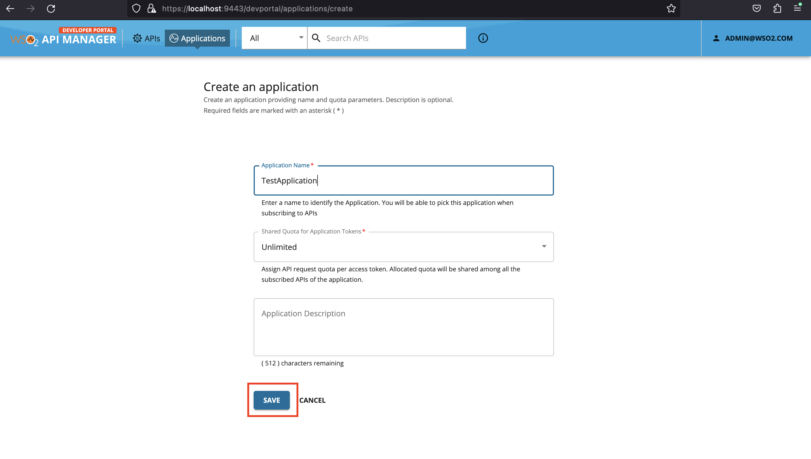
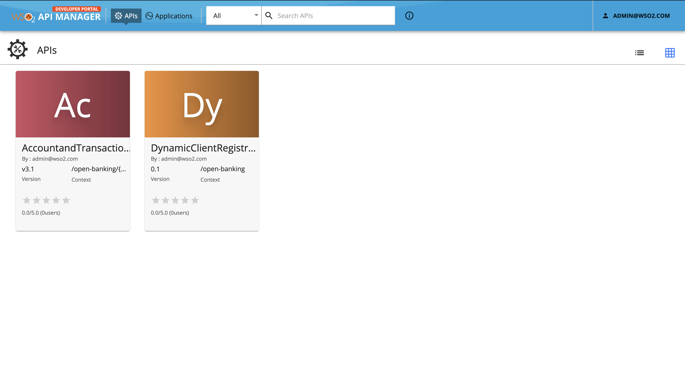
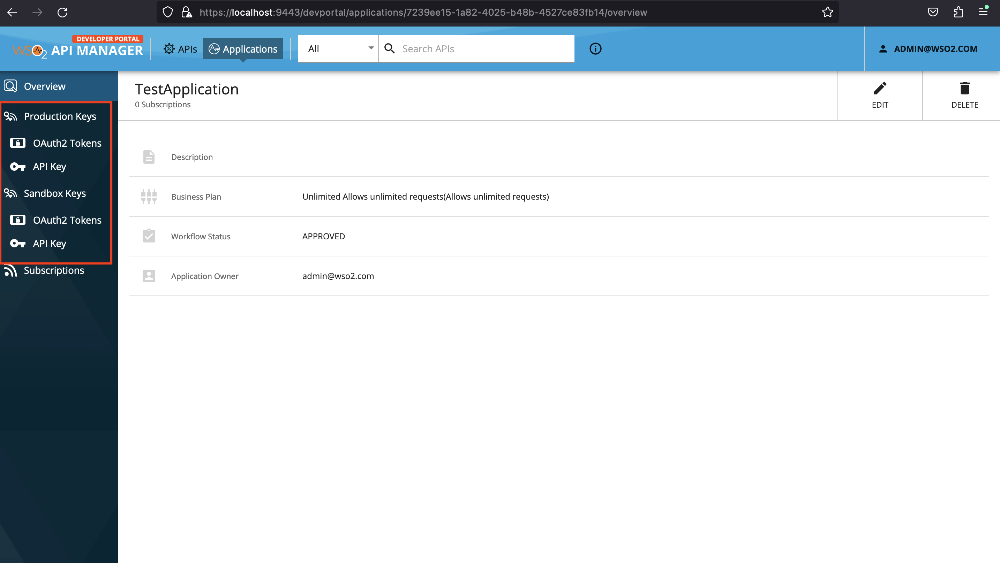
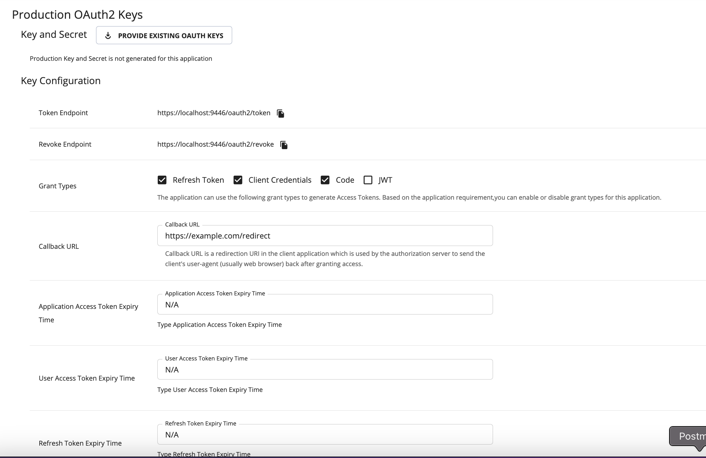

### Step 1: Sign up as a TPP

1. Go to the Developer portal at <https://<APIM_HOST>:9443/devportal>.

2. Go to the **Applications** tab.   

3. In the Sign-in form, click **Create Account**.   

4. Provide a username and click **Proceed Self Register**.     

5. Fill out the **Create New Account** form to complete registration.

6. Read terms and conditions and click the checkbox to agree to the terms and conditions.  

7. Click Register.

### Step 2: Sign in to the Developer Portal as the TPP

1. Now, sign in to the [Developer portal](https://<APIM_HOST>:9443/devportal) as the TPP.

2. Enter the username and the password you entered when signing up as a TPP.

3. Click Continue. Now, you are on the home page of the Developer Portal.

### Step 3: Create an application

1. In the Developer Portal, go to the Applications tab. 

2. Click **ADD NEW APPLICATION**. [applications_tab](../assets/img/learn/mcr/create-new-application.png)  

3. Enter the following application details.  

4. Click **SAVE**. The Developer Portal displays the created application as follows: 

 
The application created via the Developer Portal allows you to observe statistics of APIs, subscribe to APIs, and access the subscribed APIs.

### Step 4: Subscribe to API

1. Go to the APIs tab in the Developer portal.

2. Select the API. 

3. Go to **Subscriptions** at the bottom of the API and select **SUBSCRIBE**.

4. Select **your application** from the drop-down list then set the **Throttling Policy** and click **SUBSCRIBE**. Once subscribed, the application can access all the supported services of the API resources.

### Step 5: Generate keys

The TPP application requires a Client ID (Consumer Key) to access the subscribed API.

1. Go to the **Applications** tab in the Developer Portal.

2. From the application list, select your application, which has subscribed to the API.

3. Select **Production Keys** > **OAuth2 Tokens or Sandbox Keys** > **OAuth2 Tokens** according to the type of key you require:
    a. Production Keys: Generates access tokens in the production environment.
    b. Sandbox Keys: Generates access tokens in the sandbox environment. 
     

4. Provide the requested information as defined below:

 | Field | Description |
       |-------|-------------|
       | Grant Types | Determine the credentials that are used to generate the access token. <ul> <li> Code: Relates to the authorisation code grant type and is applicable when consuming the API as a user. **It is mandatory to select the code grant type for regulatory applications.** </li> <li> Client Credentials: Relates to the client credentials grant type and is applicable when consuming the API as an application. </li> <li> Refresh Token: To renew an expired access token. </li> </ul> |
       | Callback URL | The URL used by the TPP to receive the authorization code sent from the bank. The authorisation code can be used later to generate an OAuth2 access token.   **This is a mandatory field for the authorization code grant type.** |
       | Regulatory Application | The type of application. If your application is compliant with the NextGenPSD2XS2A framework, it is a Regulatory application. |

5. Click **GENERATE KEYS** to generate production or sandbox keys. It generates the consumer key and consumer secret.

6. Sign in to the Management Console at <https://<IS_HOST>:9446/carbon/>.

    a. In the Main tab, click **Identity** -> **Service Providers** -> **List**.

    b. Select the Service Provider of the created application, and click the corresponding Edit icon.

    c. Under **Select SP Certificate Type** select Upload SP certificate and upload the certificate.
    
    

    Certificates can be found in Public Certificate and Private Key.

    d. Expand the **Claim Configuration** section.

    e. Select **http://wso2.org/claims/username** from the **Subject Claim URI** list.

    f. Click **Update** to save the configurations.

